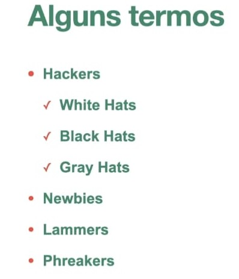
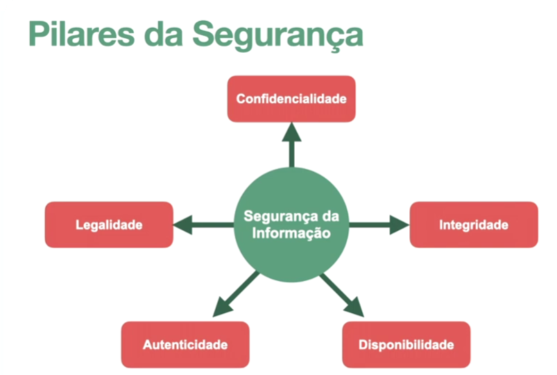
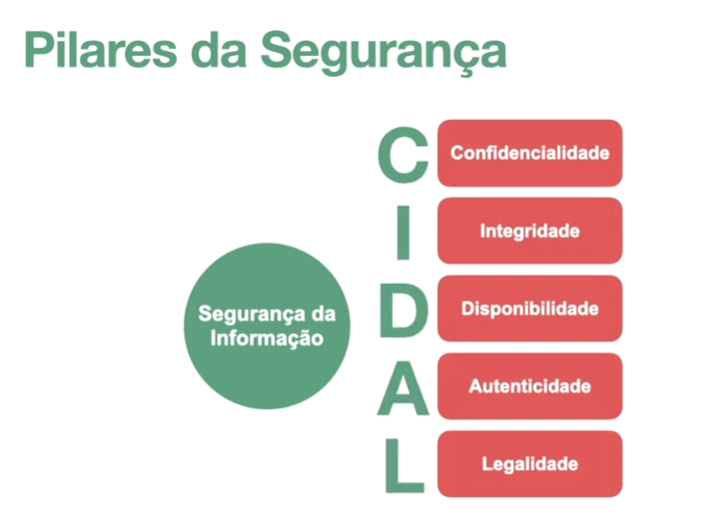

# Estudo de Segurança da Informação

---

Módulo 2
início 22/07/26
fim ????
aula 6/27

Módulo 1 
início 15/07/26
fim 21/07/26
aula 18/18

Módulo 0 
início 09/07/26
fim 15/07/26
aula 18/18

#### Sumário
- [Definição](#definição)
- [Cartilha Cert.br](#cartilha-certbr)

---

#### Definição

Segurança da informação é a prática de proteger dados físicos e digitais contra acessos não autorizados, uso indevido ou destruição. Ela se baseia nos princípios de confidencialidade, integridade, disponibilidade e autenticidade, utilizando tecnologias como criptografia, controles de acesso e backups para garantir a continuidade dos negócios.

---

#### Cartilha Cert.br

[Cartilha Cert.br](https://cartilha.cert.br/ "Cartilha Cert.br")

---

#### Conceitos

---

#### Pilares

---
